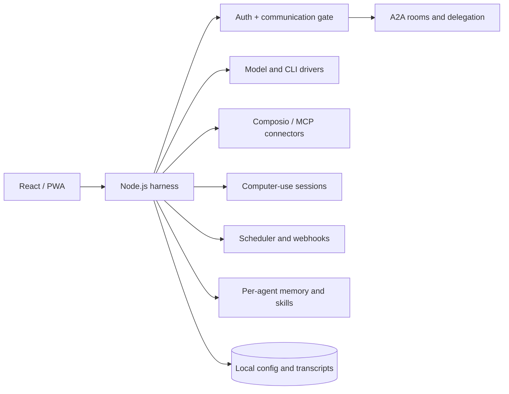

# MultiBot

MultiBot is a self-hosted multi-agent orchestration builder. Configure each
agent with its own model, skills, memory, tools, schedule, and permissions;
then let agents collaborate through A2A rooms and delegated turns.

The project is in active development. Provider credentials and optional
connectors are supplied by the operator. No hosted service or usage guarantee
is implied.

## Capabilities

- Per-agent model, skills, memory, tools, permissions, and runtime settings
- A2A collaboration through shared rooms and delegation
- Composio connectors and MCP servers, enabled per installation
- Browser/computer-use sessions with approval boundaries
- Scheduled and webhook-triggered routines
- Code-enforced communication gate for inter-agent messages
- React/PWA interface with a Node.js harness

## Architecture



The harness is the network boundary; local configuration and transcripts
remain on the operator's machine.

## Quick start

Requirements: Node.js 24+, Git, and pnpm 10+.

```sh
git clone https://github.com/E4B-labs/multibot-desktop.git
cd multibot-desktop
corepack enable
pnpm install --frozen-lockfile
pnpm dev:server
```

In another terminal, start the Vite UI:

```sh
pnpm dev
```

Open the URL printed by Vite.

Useful checks:

```sh
pnpm lint
pnpm typecheck
pnpm test
pnpm build
```

## Configuration and environment

- Root `.env.example`: optional Vite build-time values.
- Runtime config: local user config file; see [`server/config.ts`](server/config.ts).

Never commit `.env` files, API keys, access tokens, generated profiles, local
databases, uploads, or transcripts. Provider keys are configured locally and
are not returned by the API.

## Screenshots

Replace placeholders with current screenshots before a tagged release.

| Desktop workspace | Agent collaboration |
| --- | --- |
| _Screenshot placeholder_ | _Screenshot placeholder_ |

## Roadmap

- Document supported provider and connector combinations
- Improve packaging and first-run setup across desktop, Linux, and Android
- Expand multi-user isolation and deployment guidance
- Add more deterministic end-to-end coverage for computer-use flows

## License

MIT. See [`LICENSE`](LICENSE).
